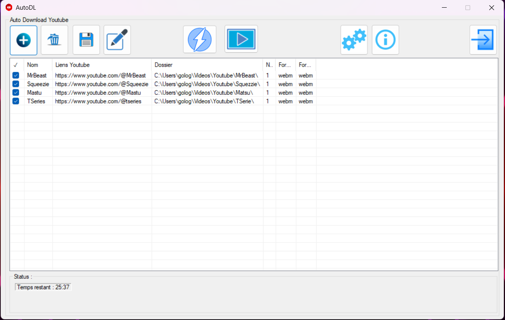
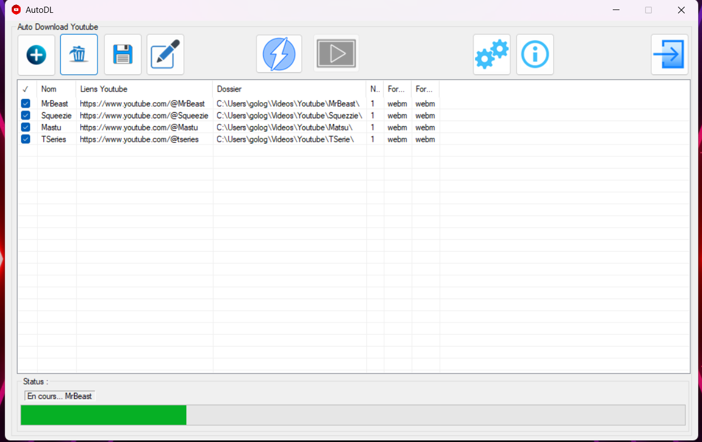
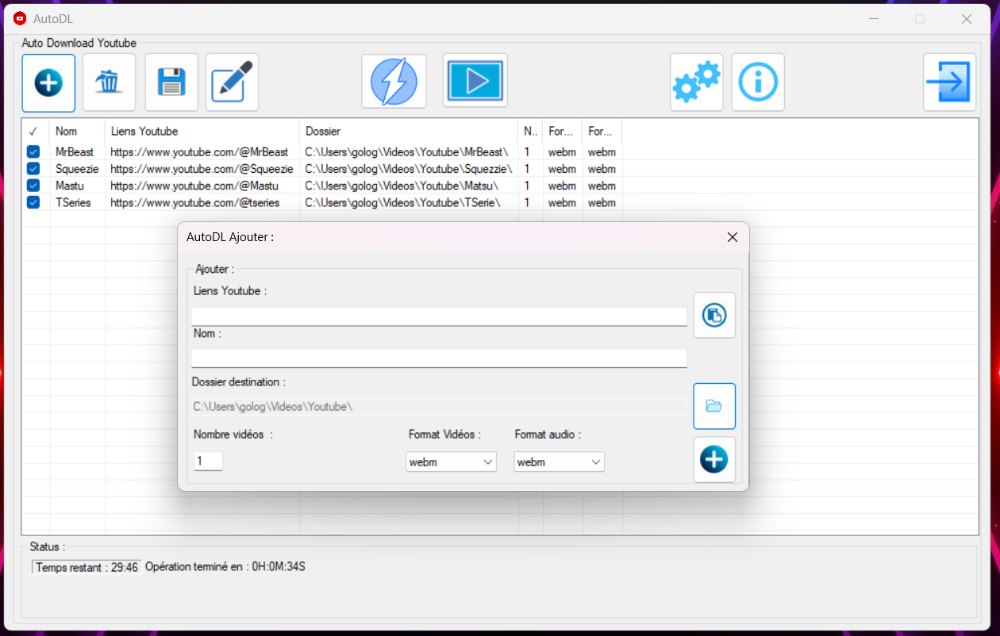

# AutoDLYTDLP
A user-friendly application that uses YT-DLP to automatically download videos from YouTube channels. It supports scheduled downloads (every X seconds/minutes/hours) based on a predefined list of subscriptions.

